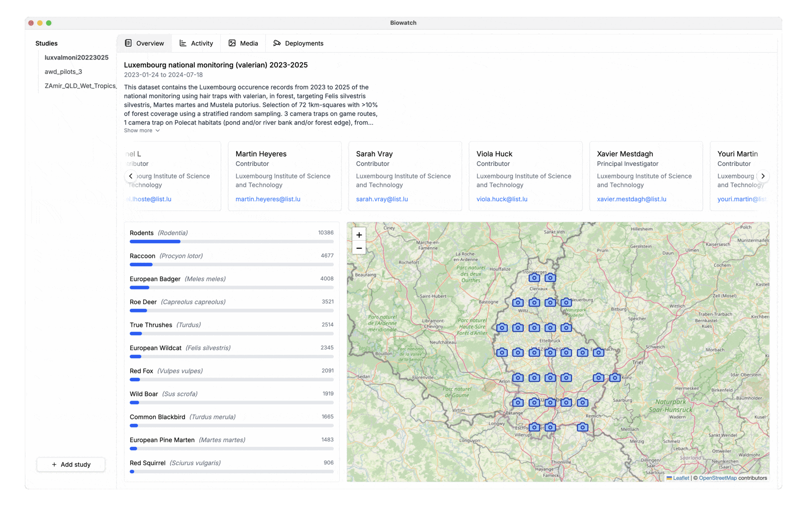

# Biowatch

<p align="center">
  
</p>

Biowatch is a powerful tool for wildlife researchers and conservationists to
analyze, visualize, and explore [CamtrapDP
datasets](https://camtrap-dp.tdwg.org/) with ease.



[Download Biowatch](https://www.earthtoolsmaker.org/tools/biowatch/)

## Key Features

- 🗺️ Interactive Maps: Visualize camera trap locations and wildlife sightings
with interactive maps and spatial analysis tools.
- 📊 Data Analysis: Generate insights with powerful analytics tools, species
identification, and temporal activity patterns.
- 🗃️ Media Management: Organize, tag, and search through thousands of camera
trap images and videos with ease.

## Development

This section explains how to contribute to the Biowatch codebase.

### Recommended IDE Setup

- [VSCode](https://code.visualstudio.com/) + [ESLint](https://marketplace.visualstudio.com/items?itemName=dbaeumer.vscode-eslint) + [Prettier](https://marketplace.visualstudio.com/items?itemName=esbenp.prettier-vscode)

### Project Setup

#### Install

```bash
$ npm install
```

#### Development Server

```bash
$ npm run dev
```

#### Build

```bash
# For windows
$ npm run build:win

# For macOS
$ npm run build:mac

# For Linux
$ npm run build:linux
```
